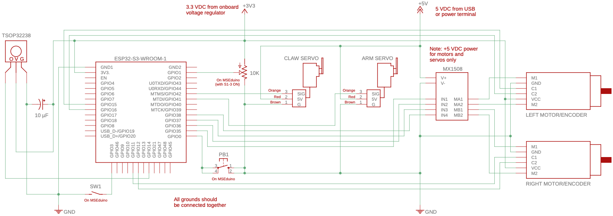
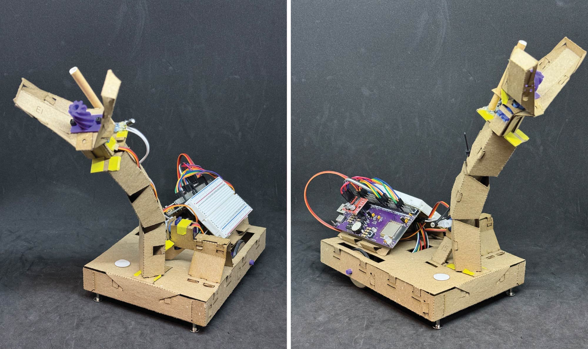
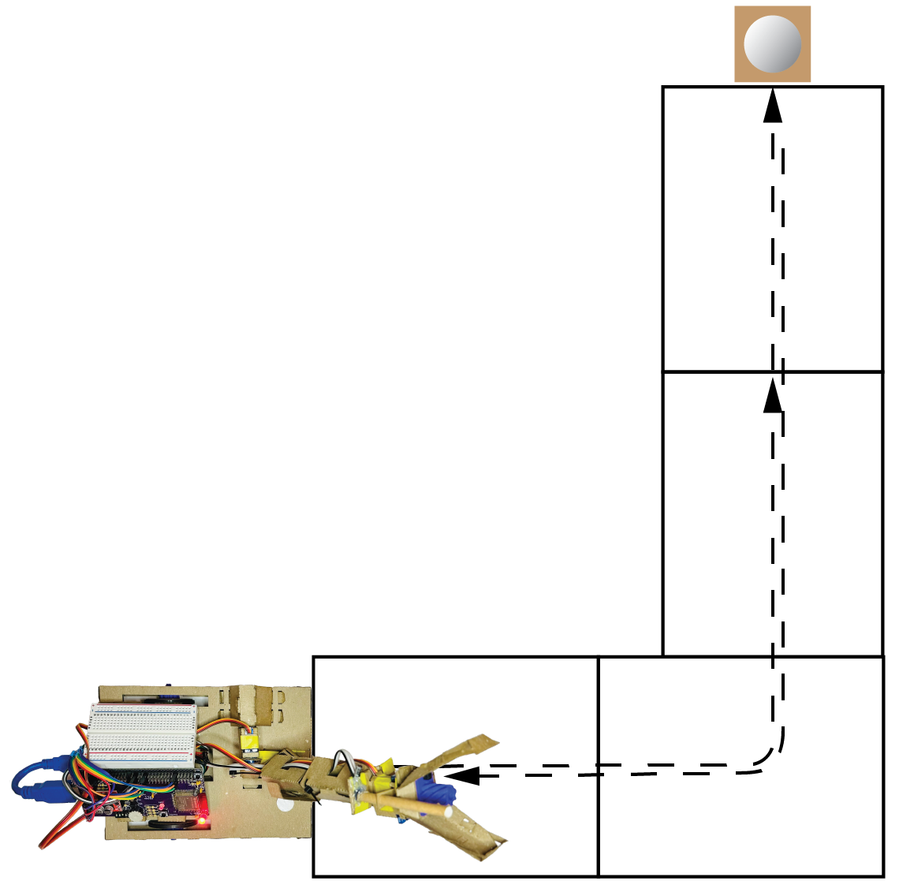

# Lab 4

## Objectives

The objective of this laboratory assignment is to further develop the skills required to build assemblies from laser-cut components and construct a functional differential-drive robot chassis. A grasping arm will be added to the MSEbot chassis and the robot will be programmed to perform a multipart task. By the end of the lab each student should:

1. Learn additional construction techniques for building assemblies from laser-cut components
2. Understand how to program a sequence of operations
2. Be able to control the motion of a simple robotic arm using RC servo motors
4. Further develop real-time programming skills

### Hardware Required

For this lab, you will require the MSEbot chassis that was assembled in Lab 3, along with other components found in the MSE 2202 Lab Kit. These include:

* MSEduino ESP32-S3 based development board
* RC servo motor ⨉ 2
* IR detector built in Lab 1
* IR beacon built in Lab 1
* Rechargable USB battery
* USB-A male to USB-A female cable for connecting battery to MSEduino
* USB-A male to mirco-USB male cable for charging battery

### Equipment

In addition to the components contained in the Lab Kit, the following equipment is available in ACEB 3435 for the purpose of conducting this laboratory:

* Needle-nose pliers
* Flush cutters
* Slot screwdriver
* Hot glue gun
* Agilent Technologies U3401A multimeter
* Rigol MSO1074 4 Channel 70 MHz oscilloscope
* PC with Arduino IDE

## MSEbot Assembly

Assembly instructions to complete the MSEbot are outlined in [MSEbot Build Instructions—Part 2](docs/MSEbot_build_part2.pdf). All of the build steps are also demonstrated the video below. The video walks through the assembly process with live-action tips and demonstrations. For this reason, it recommended that, in addition to carefully reading the instructions, the video be watched far enough ahead to ensure that all of the relevant information and guidance has been viewed for each step.

The build steps for the complete MSEbot are as follows:

1. [[00:03]](https://www.youtube.com/watch?v=ek9rCtSRI8U&t=3s) Overview of MSEbot components
2. [[00:53]](https://www.youtube.com/watch?v=ek9rCtSRI8U&&t=53s) Attaching hex standoff to claw 
3. [[02:50]](https://www.youtube.com/watch?v=ek9rCtSRI8U&t=170s) Leadscrew and nut preparation
4. [[03:22]](https://www.youtube.com/watch?v=ek9rCtSRI8U&t=202s) Folding Component 13 (claw)
5. [[10:14]](https://www.youtube.com/watch?v=ek9rCtSRI8U&t=614s) Integrating RC servo into claw
6. [[15:56]](https://www.youtube.com/watch?v=ek9rCtSRI8U&t=956s) Plug in hot glue gun
7. [[16:04]](https://www.youtube.com/watch?v=ek9rCtSRI8U&t=964s) Folding Component 13 continued
8. [[17:26]](https://www.youtube.com/watch?v=ek9rCtSRI8U&t=1046s) Gluing lead screw to hex standoff
9. [[19:44]](https://www.youtube.com/watch?v=ek9rCtSRI8U&t=1184s) Adjusting claw RC servo position
10. [[20:13]](https://www.youtube.com/watch?v=ek9rCtSRI8U&t=1213s) Connecting leadscrew nut to claw
11. [[24:08]](https://www.youtube.com/watch?v=ek9rCtSRI8U&t=1448s) Folding Component 14 (arm)
12. [[33:05]](https://www.youtube.com/watch?v=ek9rCtSRI8U&t=1985s) Joining claw to arm
13. [[37:09]](https://www.youtube.com/watch?v=ek9rCtSRI8U&t=2229s) Integrating IR receiver module into claw/arm
14. [[39:52]](https://www.youtube.com/watch?v=ek9rCtSRI8U&t=2392s) Folding Component 15
15. [[41:03]](https://www.youtube.com/watch?v=ek9rCtSRI8U&t=2463s) Folding Component 16
16. [[42.34]](https://www.youtube.com/watch?v=ek9rCtSRI8U&t=2554s) Integrating RC servo into Components 15 and 16
17. [[48:02]](https://www.youtube.com/watch?v=ek9rCtSRI8U&t=2882s) Chassis disassembly
18. [[49:15]](https://www.youtube.com/watch?v=ek9rCtSRI8U&t=2955s) Joining arm to chassis
19. [[50:03]](https://www.youtube.com/watch?v=ek9rCtSRI8U&t=3003s) Joining arm RC servo to chassis
20. [[52:47]](https://www.youtube.com/watch?v=ek9rCtSRI8U&t=3167s) Connecting arm RC servo to arm
21. [[55:10]](https://www.youtube.com/watch?v=ek9rCtSRI8U&t=3310s) Chassis reassembly
22. [[56:07]](https://www.youtube.com/watch?v=ek9rCtSRI8U&t=3367s) Arm RC servo wiring
23. [[56:24]](https://www.youtube.com/watch?v=ek9rCtSRI8U&t=3384s) Claw RC servo wiring
24. [[56:50]](https://www.youtube.com/watch?v=ek9rCtSRI8U&t=3410s) IR Receiver wiring

The electrical connections are as follows:

The assembled MSEbot should resemble the one shown below:

## Ping Pong Ball Beacon Assembly

The IR beacon that was constructed in [Lab 1](https://github.com/MSE2202/Lab1/blob/main/docs/IR-beacon-assembly.md) will be integrated into a simple stand that will irradiate a ping pong ball, allowing it to be localized by the MSEbot. The complete build is demonstrated in the following video.

1. Cut a square that is approximately 45 mm on each side from the remnants of the card stock from Components 14 and 16.

2. Cut a rectangle that is approximately 55 mm ⨉ 72 mm from the remnants of the card stock from Components 13 and 15.

3. Take the length of straw that remains from the piece attached the MSEbot claw and IR receiver. It should be about 130 mm long. Use a pair of scissors to make a set of 10 mm long cuts into the length at one end of the straw every 90º (4 cuts at 12, 3, 6, and 9 o'clock). Make a set of similar, but longer, cuts at the other end of the straw. Each cuts should be approximately 25 mm long.

4. Bend each of the 25 mm cuts outwards by about 45º. Use a hot glue gun to affix the bent pieces to the 45 mm square card stock. The straw should be perpendicular to the card stock.

5. Insert the IR LED of the IR beacon into the bottom of the straw. The leads will likely need to be bent to accommodate this.

6. Bend each of the 10 mm cuts outwards by about 45º. Place the ping pong ball on top of the resulting stand.

7. Connect the lithium polymer battery to the battery connector. The blue LED onboard the ESP-01S should start blinking. Remember that the IR LED cannot be observed directly.

## Code

During the build process, test code must be loaded onto the MSEduino. The code used for Laboratory 4 is an updated version of the sketch used for Laboratory 3. It requires an updated version of the [MSE2202_Lib library](https://github.com/MSE2202/MSE2202_Lib) that was used during Lab 1. You will have to update the library to the latest version (v2) in order to compile the Lab 4 code. Instructions for updating the library are included in the [MSE2202_Lib README](https://github.com/MSE2202/MSE2202_Lib/blob/main/README.md). From there, you can clone this repository, which contains the MSEbot base code in the [Lab4](Lab4) folder.

As a reminder, the code assumes that all of the DIP switches, except for S1-2, are in the on position. This will enable the Smart LED (S1-4) and potentiometer (S1-3). SW1 (S1-1) serves to enable/disable and disable the motors (i.e., the motors will not turn when off). The potentiometer controls the speed of the motors in drive mode. Note that if the pot is rotated fully clockwise, the motor speed will be very slow; rotate counterclockwise to increase the motor speed.

* **Mode 0**—Robot is stopped. The mode indicator glows red. This mode is the default on power up or reset.
* **Mode 1**—Normal run mode. The mode indicator glows green. This mode is selected by pressing the Mode button once. There is a 5 second delay before the motor control code is executed. The pot controls the speed of the motor. The test code repeats a forward, reverse, turn left, turn right, stop sequence.
* **Mode 2**—Test IR receiver. The mode indicator glows blue. This mode is select by pressing the Mode button twice. Any received characters are printed to the serial monitor.
* **Mode 3**—Test claw servo. The mode indicator glows yellow. This mode is select by pressing the Mode button three times. The potentiometer controls the position of the RC servo used to open and close the claw. Note that default the range of the claw servo may need to be adjusted for your robot.
* **Mode 4**—Test arm servo. The mode indicator glows pale blue. This mode is select by pressing the Mode button four times. The potentiometer controls the position of the RC servo used to extend and retract the shoulder joint of the arm.

In all modes you can also connect your MSEbot to a computer and use the serial monitor to observe the debugging messages.

### Build and Flash

Open the [Arduino IDE](https://www.arduino.cc/en/software) and configure it for the ESP32. Use a USB-A extension cable to connect your MSEduino to your computer. Use the **Tools→Board→esp32** menu to select the **Adafruit Feather ESP32-S3 No PRAM board**. The Port should be set as **COMx** on Windows or **dev.cu.usbmodel14101** (or similar) on Mac. The code provided with this lab requires version 2.0.11 of the Arduino-ESP32 boards. Use the **Tools→Board→Boards Manager...** menu and find the **esp32 by Espressif** board package. Confirm that the version is **2.0.11**. If necessary, use the dropdown menu to change versions. The code will not work in versions 3.0+ due to changes made to the underlying esp-idf API.

#### VSCode and PlatformIO

Note that as an alternative to the Arduino IDE, this project can be developed using [VSCode](https://code.visualstudio.com) with the [PlatformIO IDE](https://platformio.org/platformio-ide) extension and the [Espressif 32 platform](https://registry.platformio.org/platforms/platformio/espressif32) installed.

## Exercise

You will need to have [git](https://git-scm.com) installed on your computer for all lab exercises. You can [download](https://git-scm.com/downloads) and install git if it is not already on your computer. 

Create a new branch **exercise** and switch to it. Modify the MSEbot basecode so that after pushing PB1, your MSEbot autonomously follows the path illustrated below to find and collect a ping pong ball irradiated with an IR signal.

Each block in the path is a standard 8.5" ⨉ 11" sheet of paper. To keep the paper from catching the Chicago bolts on the bottom of the MSEbot, the sheets should be taped together along the full edge length. The stages of the task are as follows:

1. Drive forward across the first two sheets of paper
2. Turn 90º counterclockwise
3. Drive forward across the third sheet of paper
4. Stop forward motion and use the IR detector in combination with adjustments of the arm height and/or rotation of the chassis to localize the ping pong ball
5. Drive forward and grab ping pong ball with the claw
6. Return to start position, drop the ball, and leave drive mode.

At all times, the robot must stay within the sheets of paper. If all goes well, your MSEbot should stop in roughly the same place that it started from with the ping pong ball within the claw, before dropping it. Show your working MSEbot to a TA. If you have not done so already, be sure to __*push your respository back to GitHub*__.  __**Failure to do so will result in a grade of 0 for the lab.**__

### Other Things to Explore

1. Extend the path with additional sheets of paper.
2. Add a "T" section to the path at which the robot must find the IR beacon to decide whether to turn right or left.
3. Use a PID-based drive system to improve the drive accuracy.

## Resources

* [Arduino Language Reference](https://www.arduino.cc/reference/en/)
* [Arduino-ESP32 GPIO API](https://docs.espressif.com/projects/arduino-esp32/en/latest/api/gpio.html)
* [GPIO Peripheral Reference](https://docs.espressif.com/projects/esp-idf/en/latest/esp32/api-reference/peripherals/gpio.html)
* [Arduino-ESP32 LEDC API](https://docs.espressif.com/projects/arduino-esp32/en/latest/api/ledc.html)
* [LEDC Peripheral Reference](https://docs.espressif.com/projects/esp-idf/en/latest/esp32/api-reference/peripherals/ledc.html)
* [SG90 RC Servo Motor Data Sheet](http://www.ee.ic.ac.uk/pcheung/teaching/DE1_EE/stores/sg90_datasheet.pdf)
* [G12-N20-100 Geared Mini DC Motor](https://www.handsontec.com/dataspecs/motor_fan/GA12-N20.pdf)
* [G12-N20-100 Specifications](docs/GA12-N20_specs.png)
* [MX1508 Dual DC Motor Driver](https://components101.com/modules/mx1508-dc-motor-driver-pinout-features-datasheet)
* [IR LED Data Sheet](https://www.we-online.com/components/products/datasheet/15400594A3590.pdf)
* [TSOP32238 IR Receiver Data Sheet](https://www.vishay.com/docs/82489/tsop322.pdf)

## Evaluation

Note that to avoid confusion with a colleague's MSEbot, a clear identifying mark (e.g., your name) must be made on your MSEduino and MSEbot. **Robots without distinct marks will not be graded.**

| Task                                     | Maximum Marks | Demo | Code | Comments |
|:-----------------------------------------|:-------------:|:----:|:----:|:--------:|
| MSEbot arm built correctly               | **20**        | 20   | —    | —        |
| Complete MSEbot operational              | **20**        | 20   | —    | —        |
| Robot can navigate path forwards         | **10**        | 5    | 3    | 2        |
| Robot can localize beacon                | **20**        | 10   | 5    | 5        |
| Robot can pick up ping pong ball         | **15**        | 8    | 4    | 3        |
| Robot can reverse to start and drop ball | **15**        | 8    | 4    | 3        |
